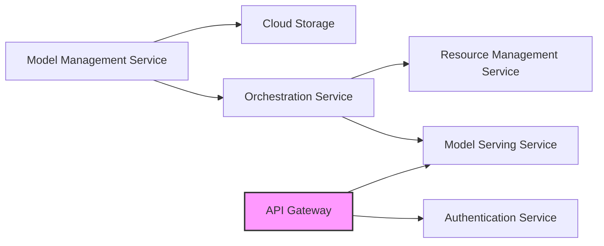
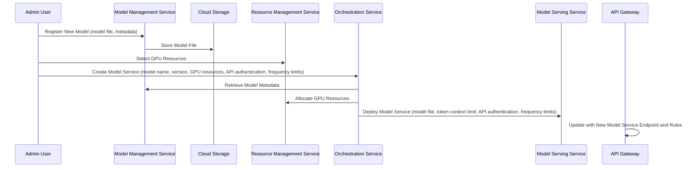

# AI Service Platform Architecture

## Overview

This document outlines the architecture for an AI service platform that aggregates resources and provides them via an API. The platform is designed to be scalable, fault-tolerant, and easy to manage.

## High-Level Architecture

The platform will be a microservices architecture. This allows for independent scaling and fault isolation.

## Key Components (Microservices)

*   **Model Management Service:** Handles model registration, versioning, storage, and metadata management.
*   **Model Serving Service:** Deploys models, provides an OpenAI-compatible API, and handles request routing.
*   **Resource Management Service:** Manages GPU resources, tracks availability, and assigns resources to model services.
*   **API Gateway:** Acts as the entry point for all external requests, handles authentication, and routes requests to the appropriate service.
*   **Orchestration Service:** Coordinates the deployment and scaling of model services based on resource availability and demand.
*   **Authentication Service:** Handles user authentication and authorization, including OIDC login and token management.

## Technology Stack

*   **Programming Languages:** Python (for AI/ML tasks), Go (for infrastructure services)
*   **Frameworks:** FastAPI/Flask (Python), Gin/Echo (Go)
*   **Model Serving:** TorchServe, TensorFlow Serving, Triton Inference Server
*   **Containerization:** Docker
*   **Orchestration:** Kubernetes
*   **Message Queue:** Kafka, RabbitMQ
*   **Database:** PostgreSQL, MongoDB
*   **API Gateway:** Kong, Traefik

## Detailed Design

### Model Management Service

*   Stores model files in a cloud storage service (e.g., AWS S3, Azure Blob Storage).
*   Uses a database to store model metadata (e.g., name, version, description, input/output schema, token context limit).
*   Provides APIs for registering new models, updating existing models, and retrieving model information.

### Model Serving Service

*   Uses a containerized model server (e.g., TorchServe, TensorFlow Serving, Triton Inference Server) to host the models.
*   Exposes an OpenAI-compatible API endpoint.
*   Handles request routing based on model name and version.
*   Implements load balancing across multiple model server instances.
*   Enforces token context limits.

### Resource Management Service

*   Monitors GPU resource usage on each node in the cluster.
*   Tracks the availability of GPU resources.
*   Provides APIs for allocating and releasing GPU resources.
*   Integrates with Kubernetes to automatically scale model services based on resource availability.

### API Gateway

*   Authenticates incoming requests using the Authentication Service.
*   Routes requests to the appropriate service based on the request path.
*   Handles rate limiting and request throttling.

### Orchestration Service

*   Monitors the health and performance of model services.
*   Automatically scales model services based on resource availability and demand.
*   Handles rolling updates and deployments.

### Authentication Service

*   Handles user authentication via OIDC.
*   Issues and manages API tokens.
*   Provides APIs for verifying token validity.

## User Scenarios

### 1. Admin User: Creating a New Model Service

1.  The admin user interacts with the **Model Management Service** to register a new model. This includes uploading the model file to cloud storage and providing metadata such as name, version, description, input/output schema, and token context limit.
2.  The admin user interacts with the **Resource Management Service** to select the required GPU resources for the model service.
3.  The admin user interacts with the **Orchestration Service** to create a new model service. This includes specifying the model name and version, the required GPU resources, API authentication method, and frequency limits.
4.  The **Orchestration Service** retrieves the model information from the **Model Management Service** and allocates the GPU resources from the **Resource Management Service**.
5.  The **Orchestration Service** deploys the model service using the **Model Serving Service**, configuring it with the specified token context limit, API authentication, and frequency limits.
6.  The **API Gateway** is updated with the new model service endpoint and its associated authentication and rate limiting rules.

### 2. Platform User: Accessing a Model Service

1.  The platform user authenticates with the **Authentication Service** using OIDC.
2.  The **Authentication Service** issues an API token to the user.
3.  The user interacts with the **API Gateway**, providing the API token in the request header.
4.  The **API Gateway** authenticates the user's token with the **Authentication Service**.
5.  The **API Gateway** routes the request to the appropriate **Model Serving Service** based on the request path.
6.  The **Model Serving Service** processes the request and returns the result to the user.

## Model Inference Service Metrics

The following are basic metrics for model inference services:

*   **Latency:** The time it takes to process a single request.
*   **Throughput:** The number of requests processed per second.
*   **GPU Utilization:** The percentage of GPU resources being used.
*   **Error Rate:** The percentage of requests that result in an error.
*   **Token Usage:** The number of tokens used per request.
*   **Concurrent Requests:** The number of requests being processed simultaneously.

## Architecture Diagrams

### 1. Overall Module Architecture Diagram

This diagram illustrates the high-level components and their relationships.



**Description:**

*   The **Model Management Service** stores and manages models in a **Cloud Storage**.
*   The **Resource Management Service** manages GPU resources.
*   The **Orchestration Service** coordinates model deployment using the **Model Serving Service** and resource allocation using the **Resource Management Service**.
*   The **API Gateway** handles external requests and authenticates them using the **Authentication Service**.

### 2. Runtime Sequence Diagrams

#### Admin User: Creating a New Model Service



#### Platform User: Accessing a Model Service

```mermaid
sequenceDiagram
    participant Platform User
    participant Authentication Service
    participant API Gateway
    participant Model Serving Service

    Platform User->>Authentication Service: Authenticate (OIDC)
    Authentication Service->>Platform User: Issue API Token
    Platform User->>API Gateway: Request Model Service (API Token)
    API Gateway->>Authentication Service: Authenticate API Token
    API Gateway->>Model Serving Service: Route Request
    Model Serving Service->>Platform User: Return Result